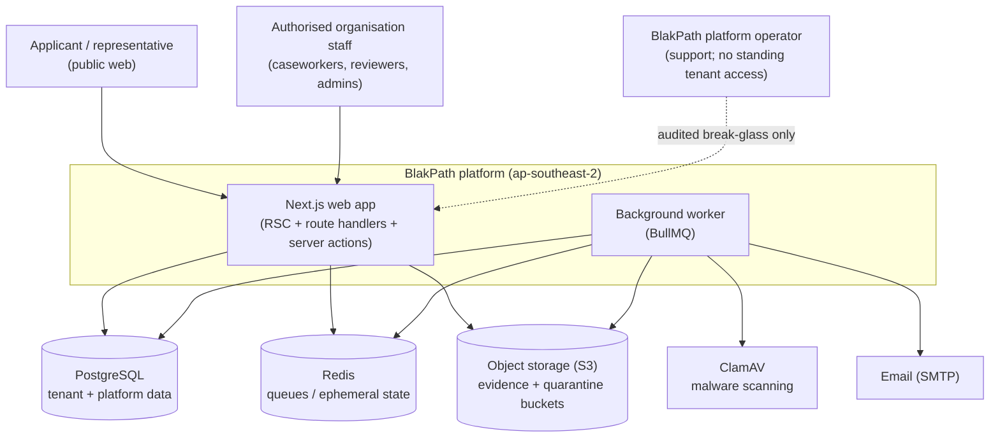
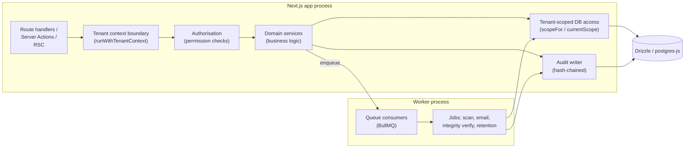
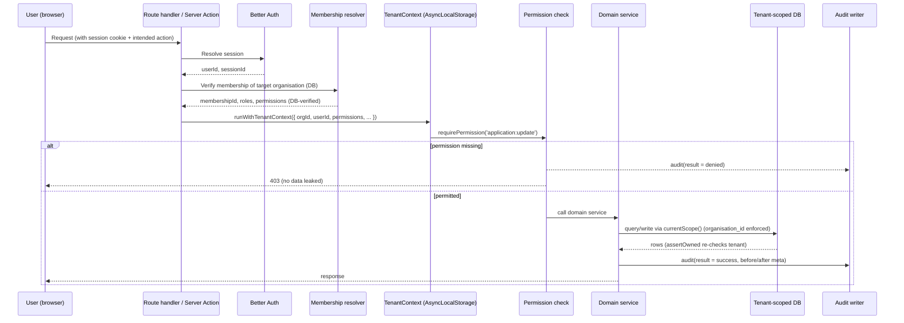

# Architecture

BlakPath is a **modular monolith** built on Next.js 16 (App Router + React
Server Components) with a single companion **background worker** process. One
deployable web application holds the whole domain, split into clearly bounded
modules that talk to each other through typed service functions rather than over
the network. This keeps operations simple for the size of the problem while
still enforcing strong internal boundaries — every module goes through the same
tenancy, authorisation and audit gates.

> Reminder that shapes every module below: **BlakPath never determines
> Aboriginality.** No module scores, ranks, infers or auto-decides. Modules
> capture information and record the decisions authorised humans make.

## Why a modular monolith

- The workload is I/O-bound case management, not a fan-out of independent
  high-scale services. A monolith removes distributed-systems failure modes
  (partial writes across services, cross-service auth drift) that would be a
  liability for a system holding this kind of sensitive data.
- Strong **in-process boundaries** (a permission check and tenant scope on every
  path) are easier to guarantee and test than cross-network trust.
- The one thing that genuinely benefits from being out-of-band — slow, retried,
  side-effecting work (virus scanning, email, integrity verification) — is
  split into the worker.

## Domains (modules)

Phase 1 lands the platform spine. Later phases add case-management domains on top
of the same tenancy/authorisation/audit foundation.

| Domain                | Responsibility                                                                                                       | Status      |
| --------------------- | -------------------------------------------------------------------------------------------------------------------- | ----------- |
| **Tenancy**           | Organisations, settings, domains, feature flags; the tenant boundary itself (`src/db/schema/tenancy.ts`)             | Phase 1     |
| **Identity & Auth**   | Better Auth tables and flows: accounts, sessions, passkeys, TOTP (`src/db/schema/auth.ts`)                           | Phase 1     |
| **Membership & RBAC** | Memberships, roles, permission catalogue, role grants, representative authorisations (`src/db/schema/membership.ts`) | Phase 1     |
| **Audit & Integrity** | Append-only hash-chained audit trail, integrity checkpoints, break-glass requests (`src/db/schema/audit.ts`)         | Phase 1     |
| **Applications**      | CoA application intake, status lifecycle, correspondence                                                             | Later phase |
| **Evidence**          | Secure document upload, quarantine → scan → serve lifecycle (`docs/evidence-scanning-design.md`)                     | Phase 3     |
| **Genealogy**         | Family/ancestry records supporting an application                                                                    | Later phase |
| **Decisions**         | Human-recorded determinations and certificate issuance                                                               | Later phase |
| **Consent**           | Consent ledger; ties representative access to recorded consent                                                       | Later phase |
| **Notifications**     | Email and in-app messaging (via the worker)                                                                          | Later phase |

Every future tenant-owned table uses the shared helpers (`organisationId()`,
`primaryId()`, `timestamps`) and is reached through the tenant-scoped data access
layer — new domains inherit isolation, not reinvent it.

## System context

Platform operators do **not** get standing access to tenant data. Any
cross-tenant support access is obtained only through the audited, time-boxed
break-glass flow (`break_glass_requests` in `src/db/schema/audit.ts`).

## Containers

Key rule: **domain logic never lives in React components or route handlers.**
Route handlers, server actions and RSC establish the tenant context and call
domain services; the services own the business rules, tenant-scoped queries and
audit writes.

## Request lifecycle

A typical authenticated, tenant-scoped mutation:

Notes:

- The **organisation id is never taken from request input.** It is derived from
  the resolved session and **verified against the membership row in the
  database** before the context is created. See
  `src/lib/tenancy/context.ts` and `docs/tenant-isolation.md`.
- The context is carried by `AsyncLocalStorage`
  (`runWithTenantContext` / `requireTenantContext`), so `currentScope()` in the
  data layer always has the verified tenant available without threading it
  through every function signature.
- Both **denied** and **failed** attempts are audited, not just successes.

## Background worker

The worker (`worker/index.ts`, run via `pnpm worker`) consumes BullMQ queues on
Redis. It exists for work that must be reliable, retried and off the request
path:

- **Evidence scanning** — pick up a quarantined upload, scan with ClamAV,
  promote clean files or hold/reject infected ones (`docs/evidence-scanning-design.md`).
- **Notifications** — send email via SMTP.
- **Audit integrity verification** — periodically re-walk the hash chain and
  write/verify integrity checkpoints (`docs/audit-log-design.md`).
- **Retention & lifecycle** — apply retention/deletion policies where lawful,
  respecting official-record obligations (`docs/privacy-architecture.md`).

Jobs run under the **same guarantees as web requests**: a job that touches
tenant data establishes a tenant context, uses the tenant-scoped data layer, and
writes audit events. Queue payloads are validated with Zod and carry the
organisation id, which is re-verified — a queue message is treated as untrusted
input, exactly like a browser request (`docs/tenant-isolation.md`).
