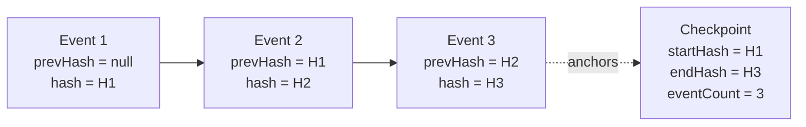

# Audit log design

Every sensitive action in BlakPath is **audit-logged**. The audit trail is
**append-only** and **tamper-evident**: rows are never updated or deleted, and a
SHA-256 hash chain makes any insertion, edit or removal detectable. This is what
lets an organisation trust that the record of who did what — including the
recording of human determinations — is intact.

Implementation: `src/db/schema/audit.ts` (`audit_events`,
`audit_integrity_checkpoints`, `break_glass_requests`).

## Event schema

Each row in `audit_events` captures one audited action:

| Field                        | Type           | Purpose                                                                                           |
| ---------------------------- | -------------- | ------------------------------------------------------------------------------------------------- |
| `id`                         | uuidv7         | App-generated id (time-ordered; known before insert, needed for chaining).                        |
| `organisationId`             | uuid, nullable | Tenant owner. **Null = platform-level** event; set = tenant event. Indexed first.                 |
| `timestamp`                  | timestamptz    | When the action occurred.                                                                         |
| `actorUserId`                | uuid, nullable | Who acted; null for system/unauthenticated events.                                                |
| `actingRole`                 | text           | The role the actor was acting under (audit attribution).                                          |
| `sessionId`                  | uuid, nullable | Session that performed the action.                                                                |
| `action`                     | text           | What happened, e.g. `application.update`, `decision.record`, `auth.signin`.                       |
| `resourceType`               | text           | Kind of resource, e.g. `application`, `evidence`, `membership`.                                   |
| `resourceId`                 | text, nullable | The affected resource id.                                                                         |
| `result`                     | enum           | `success` \| `failure` \| `denied` (`audit_result`). `denied` = authz refusal; `failure` = error. |
| `reason`                     | text, nullable | Human-readable reason, especially for `denied`/`failure`.                                         |
| `ipAddress`, `userAgent`     | text           | Request origin.                                                                                   |
| `correlationId`, `requestId` | text           | Trace/correlation, from the `TenantContext`.                                                      |
| `beforeMeta`, `afterMeta`    | jsonb          | **Minimal, non-sensitive** change context — never full evidence payloads or secrets.              |
| `prevHash`                   | text, nullable | Hash of the previous event in this chain (null for the first).                                    |
| `hash`                       | text           | SHA-256 of this event's canonical content **plus** `prevHash`.                                    |

Attribution comes straight from the verified `TenantContext`
(`src/lib/tenancy/context.ts`): `organisationId`, `userId`, acting `roles`,
`sessionId`, `correlationId`, `requestId`, `ipAddress`, `userAgent`. This means
audit binding is tenant-scoped by construction (`docs/tenant-isolation.md`).

## SHA-256 hash chaining

Each event is linked to the previous one so the sequence cannot be silently
altered:

```text
hash(n) = SHA-256( canonical(event n fields)  ‖  prevHash(n) )
prevHash(n) = hash(n-1)      // null for the first event in the chain
```

- `canonical(...)` is a deterministic serialisation of the event's content
  fields (stable key order, normalised types) so the same event always hashes to
  the same value.
- Chains are **per scope**: a per-tenant chain (`organisation_id` set) and a
  platform chain (`organisation_id` null). Appends serialise per chain so
  `prevHash` is well-defined.



Editing event 2 changes H2, which breaks the `prevHash` link stored on event 3 —
the mismatch pinpoints the tampering. Deleting a row breaks the count and the
chain link at that point.

## Integrity checkpoints & periodic verification

`audit_integrity_checkpoints` anchors a contiguous run of events:

- Fields: `organisationId` (null = platform chain), `periodStart`, `periodEnd`,
  `eventCount`, `startHash`, `endHash`, and `verifiedAt` / `verifiedBy`.
- **Verification** re-walks the chain from `startHash` to `endHash`, recomputes
  each `hash`, confirms every `prevHash` links correctly, and checks
  `eventCount`. If everything matches, no row was inserted, edited or removed in
  that period.
- A **worker job** runs verification periodically (`docs/architecture.md`),
  recording `verifiedAt`/`verifiedBy` and raising an alert on any mismatch.
  Authorised users can also trigger verification via `audit:verify`
  (`docs/authorization-matrix.md`).

## Append-only guarantee

- **Application layer:** there is exactly one audit-write path (append). No
  service exposes UPDATE or DELETE for `audit_events`.
- **Database layer:** the audit role's privileges are restricted to `INSERT` and
  `SELECT` on `audit_events` and `audit_integrity_checkpoints`; UPDATE/DELETE are
  not granted, and a trigger rejects any attempt as a further backstop.
- **Retention:** audit records are retained per policy and are **not** subject to
  ordinary record-deletion, because deleting them would defeat their purpose
  (`docs/privacy-architecture.md`). Any lawful expiry happens by whole,
  verified, archived periods — never by editing individual rows.

## Redaction rules

The audit trail records _that_ something happened and _who_ did it, not the
sensitive content itself:

- `beforeMeta` / `afterMeta` carry **minimal** change context — changed field
  names, status transitions, ids — **never** full evidence payloads, personal
  identity documents, genealogy detail, passwords, TOTP secrets or tokens.
- Secrets are never written to audit under any circumstance.
- Because the hash covers the content fields, redaction is done **at write time**
  (only safe metadata is ever stored); the stored row is not later scrubbed, so
  the chain stays intact.
- Reads of the audit trail are themselves permission-checked (`audit:read`) and
  tenant-scoped, so one tenant can never read another's audit history.

## What must be audited

At minimum: authentication events (sign-in, factor changes, recovery-code use),
every permission **denial**, all membership/role changes, application and
evidence lifecycle actions, **recording and reviewing determinations**,
certificate issue/revoke, feature-flag and settings changes, and every
break-glass state transition. Both allowed and refused attempts are logged.
