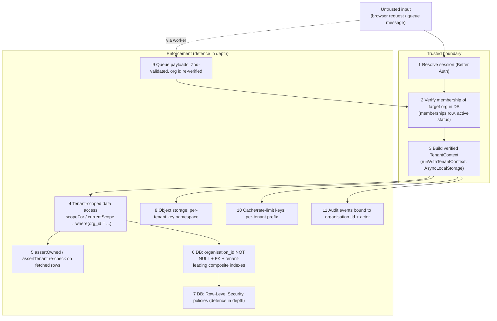

# Tenant isolation

BlakPath is multi-tenant: many authorised organisations share one deployment,
and **their data must never leak across the tenant boundary.** This is the
single most important security property in the system after "the software never
determines Aboriginality".

The model is **defence in depth**: no one control is trusted on its own. A row
would have to defeat several independent guards to cross tenants.

## Non-negotiables

- Every tenant-owned row carries a non-null `organisation_id`
  (`organisationId()` helper in `src/db/schema/_helpers.ts`).
- The organisation id is **never** trusted from the browser, a URL, a form field
  or a queue message. It is **derived from the authenticated session and
  DB-verified against the user's membership** before any tenant work begins.
- The `organisations` table is the tenant boundary itself, so it carries **no**
  `organisation_id` (see `src/db/schema/tenancy.ts`).

## The layers

### 1–3. Verified TenantContext at a trusted boundary

`src/lib/tenancy/context.ts` defines `TenantContext` and carries it through the
call tree with `AsyncLocalStorage`:

- `runWithTenantContext(ctx, fn)` establishes the context at a trusted boundary
  (route handler, server action, or job runner) **after** membership has been
  confirmed against the database.
- `requireTenantContext()` returns it inside tenant-scoped code, or throws
  `TenantContextError` if none is active — so tenant-touching code cannot run
  "context-less".
- The context holds the verified `organisationId`, `userId`, `membershipId`,
  resolved `permissions`, `roles`, `sessionId`, and correlation/request ids used
  for audit attribution.

The context is only ever constructed from DB-verified values. There is no code
path that builds it from a browser-supplied tenant id.

### 4–5. Tenant-scoped data access

All tenant data goes through `src/db/tenant-db.ts` so the `organisation_id`
predicate is applied **centrally** and cannot be forgotten at a call site:

- `currentScope()` derives a `TenantScope` from the active context;
  `scopeFor(orgId)` builds one explicitly (used by jobs/tests).
- `scope.where(orgColumn, ...extra)` always AND-s
  `eq(organisation_id, scope.organisationId)` in front of caller predicates.
- `scope.insertValues(values)` spreads the tenant id into every insert so it is
  always set.
- `scope.assertOwned(row)` throws `TenantIsolationError` if a fetched row's tenant
  differs from the scope — a safety net for any query accidentally written
  without the predicate. `assertTenant(expected, actual)` is the same guard for
  hot paths and tests.

The raw `db` client (`src/db/client.ts`) is reserved for auth, platform-level
tables, migrations and infrastructure — **not** for tenant-owned data.

### 6. Database constraints & indexes

- `organisation_id` is `NOT NULL` on tenant tables and carries a foreign key to
  `organisations.id` with `ON DELETE CASCADE`, so orphaned tenant rows cannot
  exist and closing a tenant removes its data.
- Uniqueness that must be per-tenant is expressed as a **composite** unique index
  leading with `organisation_id` (e.g. `memberships_org_user_unique`,
  `organisation_settings_org_unique`, `roles_org_slug_unique`).
- Listing/lookup indexes lead with `organisation_id`
  (e.g. `memberships_org_status_idx`,
  `representative_authorisations_org_subject_idx`,
  `audit_events_org_timestamp_idx`) so scoped queries are both correct and fast.

### 7. Row-Level Security (defence in depth)

RLS policies on tenant tables restrict rows to the current tenant using a
session variable (e.g. `app.current_organisation` set from the verified context).
This is a **backstop**: even a query that somehow omitted the application
predicate would still be filtered by the database. Application-layer scoping
remains the primary control; RLS is the second wall.

### 8. Object-storage namespace

Evidence objects are keyed under a per-tenant namespace
(`{organisation_id}/...`) across the evidence and quarantine buckets. Presigned
URLs are minted only for keys inside the caller's tenant namespace, so one
tenant can never address another tenant's objects
(`docs/evidence-scanning-design.md`).

### 9. Queue payload validation

BullMQ job payloads are **untrusted input**. Every payload is validated with Zod
and carries the `organisation_id`; the worker re-verifies it and builds a fresh,
DB-verified tenant context before touching data. A forged or malformed message
cannot widen access.

### 10. Cache & rate-limit key prefixing

Any Redis-backed cache, lock or rate-limit key that holds tenant-derived data is
prefixed with the organisation id, so cached values cannot bleed between tenants
and per-tenant limits stay independent.

### 11. Audit binding

Every tenant event in `audit_events` is written with its `organisation_id` and
actor, and indexed tenant-first. A null `organisation_id` denotes a
platform-level event only. This means the audit trail is itself tenant-scoped and
cannot be read across the boundary (`docs/audit-log-design.md`).

## Automated isolation tests that must pass

These tests are treated as release gates. Any change that would let one fail must
not merge.

1. **Row insert always stamps the tenant.** `scope.insertValues` sets
   `organisation_id`; inserting without a scope is impossible for tenant tables.
2. **Cross-tenant read returns nothing.** A query built with tenant A's scope
   returns zero of tenant B's rows even when B's ids are supplied directly.
3. **`assertOwned` rejects foreign rows.** Handing a tenant-B row to tenant A's
   scope throws `TenantIsolationError`.
4. **`assertTenant` mismatch throws.** Mismatched expected/actual org ids throw.
5. **Missing context throws.** Calling `currentScope()` /
   `requireTenantContext()` with no active context throws `TenantContextError`.
6. **Browser-supplied org id is ignored.** A request carrying an
   `organisation_id` for a tenant the user is not a member of is refused; the
   context is built only from the DB-verified membership.
7. **RLS backstop blocks a predicate-less query.** With RLS enabled, a raw query
   missing the tenant predicate still returns only the current tenant's rows.
8. **Object-key namespace enforced.** Presigning or reading an object key outside
   the caller's `{organisation_id}/` prefix is refused.
9. **Queue payload with foreign/invalid org is rejected.** A job message whose
   org id fails Zod validation or membership re-verification is not processed.
10. **Cache keys are tenant-prefixed.** Cached/rate-limit entries created under
    tenant A are not readable under tenant B.
11. **Audit reads are tenant-scoped.** Tenant A cannot read tenant B's audit
    events; platform-level (null-org) events are not exposed to tenants.
12. **Cascade on tenant close.** Deleting an organisation cascades to all its
    tenant-owned rows, leaving no orphans.
