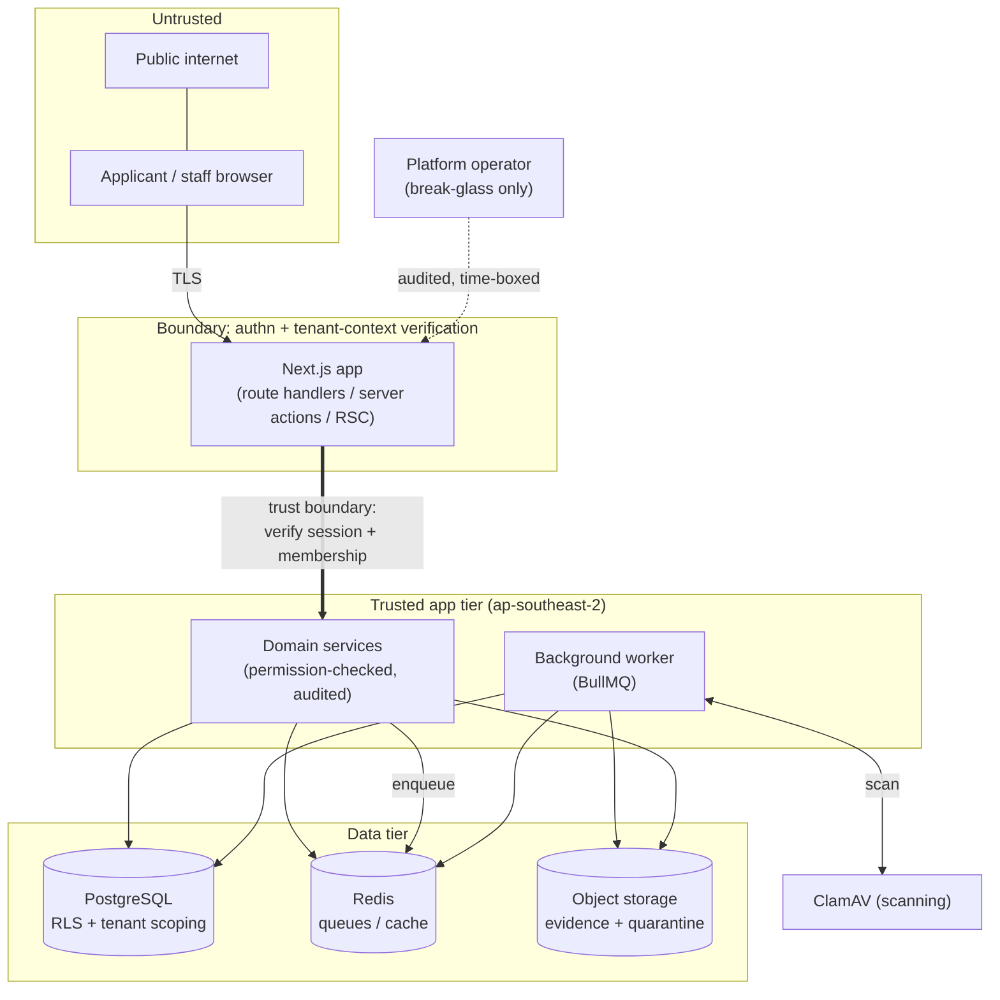

# Threat model

BlakPath holds some of the most sensitive information a person can share:
evidence of their identity, their family and ancestry, and the decisions an
authorised organisation makes about their Confirmation of Aboriginality. A breach
here is not just a data-protection failure — it is a cultural and personal harm.
This document sets out what we protect, where trust boundaries lie, the main
threats (STRIDE), the mitigations, and our **fail-secure** stance.

> The most important safety property is upstream of everything here: **BlakPath
> never determines Aboriginality.** There is no model to poison, no score to
> game, no automated decision to subvert — determination authority rests with
> authorised humans (`docs/privacy-architecture.md`).

## Assets

| Asset                          | Why it matters                                         | Where it lives                                                  |
| ------------------------------ | ------------------------------------------------------ | --------------------------------------------------------------- |
| **Identity evidence**          | Uploaded documents proving identity; highly sensitive. | Object storage (evidence/quarantine buckets), `ap-southeast-2`. |
| **Genealogy / ancestry**       | Family relationships and ancestry records.             | PostgreSQL (later-phase domain), tenant-scoped.                 |
| **Determinations & decisions** | Human-recorded outcomes and their reasoning.           | PostgreSQL, tenant-scoped; recorded via audited actions.        |
| **Certificates**               | Issued Confirmation certificates.                      | PostgreSQL + object storage; issue/revoke audited.              |
| **Authentication secrets**     | Password hashes, TOTP secrets, recovery codes.         | `accounts`, `twoFactors` — hashed / envelope-encrypted.         |
| **Audit trail**                | Tamper-evident record of who did what.                 | `audit_events` (append-only, hash-chained).                     |
| **Tenant boundary metadata**   | `organisation_id` on every tenant row.                 | PostgreSQL.                                                     |

## Trust boundaries

The critical boundary is between **untrusted input** (browser requests, queue
messages) and the **trusted app tier**. Nothing crosses it without a resolved
session and a **DB-verified** tenant context; nothing supplied by the client is
trusted as a tenant id (`docs/tenant-isolation.md`).

## STRIDE analysis

### Spoofing

- **Threat:** impersonating a user or another tenant.
- **Mitigations:** Better Auth sessions; argon2 password hashing; **mandatory
  staff MFA** (passkeys/TOTP); step-up re-auth for sensitive actions; sessions
  bound server-side with `ipAddress`/`userAgent`; tenant id derived from the
  verified membership, never the request (`docs/authentication.md`).

### Tampering

- **Threat:** altering records, evidence, or the audit trail.
- **Mitigations:** append-only, **SHA-256 hash-chained** audit with periodic
  integrity checkpoints; DB privileges deny UPDATE/DELETE on audit tables;
  optimistic concurrency (`rowVersion`) on mutable records; Zod validation on all
  inputs and queue payloads; object integrity verified during the scan lifecycle
  (`docs/audit-log-design.md`, `docs/evidence-scanning-design.md`).

### Repudiation

- **Threat:** a user denying an action they performed.
- **Mitigations:** every sensitive action — including **denials** — is audited
  with actor, acting role, session, correlation id and result. Recording and
  reviewing determinations, and issuing/revoking certificates, are all audited.
  The hash chain makes the record non-repudiable.

### Information disclosure

- **Threat:** leaking evidence, genealogy or decisions — especially across
  tenants.
- **Mitigations:** layered tenant isolation (application scoping + `assertOwned`
  - `NOT NULL` FKs + composite indexes + **RLS backstop**); per-tenant
    object-storage namespaces and short-lived presigned URLs; **envelope
    encryption (AES-256-GCM)** for sensitive fields and secrets; TLS in transit;
    audit redaction (secrets/payloads never written to audit); least-privilege
    RBAC; **no standing operator access** (break-glass only)
    (`docs/tenant-isolation.md`, `docs/privacy-architecture.md`).

### Denial of service

- **Threat:** overwhelming the app, the scanner, or the queues.
- **Mitigations:** Redis-backed, tenant-prefixed rate limiting; bounded upload
  sizes/types; presigned uploads keep large transfers off the app tier; BullMQ
  retries with backoff and dead-lettering; a stalled scanner **holds** files in
  quarantine rather than failing open (fail-secure, below).

### Elevation of privilege

- **Threat:** gaining permissions or crossing the tenant boundary.
- **Mitigations:** access requires active membership → role → permission key,
  resolved and cached only from DB-verified data; **separation of duties**
  (record ≠ review ≠ certify; admin ≠ adjudicate); platform-operator flag grants
  no tenant data; break-glass is scoped, time-boxed, step-up verified,
  tenant-notified and fully audited (`docs/authorization-matrix.md`).

## Fail-secure stance

When something goes wrong, BlakPath **denies rather than exposes**:

- **Scanner unavailable → quarantine holds.** If ClamAV is down, unreachable or
  errors, the uploaded file stays in the quarantine bucket and is **never
  promoted or served**. Availability of scanning is never traded for exposing an
  unscanned file (`docs/evidence-scanning-design.md`).
- **No tenant context → refuse.** Tenant-touching code with no active verified
  context throws `TenantContextError`; it does not guess a tenant.
- **Permission ambiguous → deny.** A missing or unresolved permission is a
  `denied` result (audited), not a default-allow.
- **Config invalid → don't boot.** `src/lib/env.ts` fails fast on malformed
  configuration rather than starting with unsafe defaults.
- **AI off by default.** `AI_FEATURES_ENABLED` defaults to `false`, and even when
  on, AI can never decide, score or infer identity
  (`docs/privacy-architecture.md`).

## Residual risks & assumptions

- Cultural governance and the correctness of human determinations sit with the
  organisation; BlakPath assures process integrity, not the merits of a decision.
- Infrastructure hardening (network policy, secret management via KMS, backups,
  patching) is assumed to be enforced in the `ap-southeast-2` deployment
  environment and is out of scope for this application-level model.
